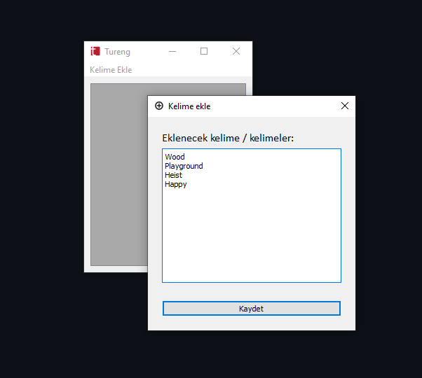
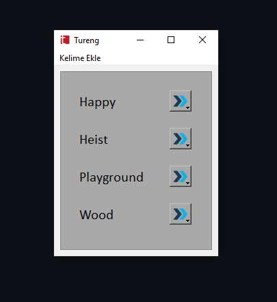
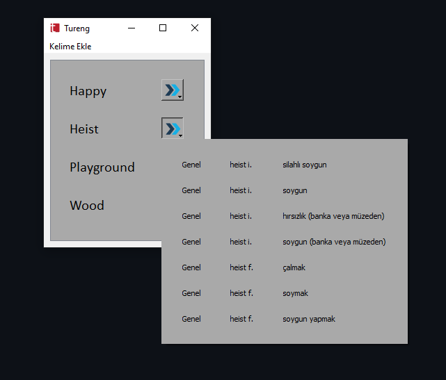

# Tureng Kişisel Sözlük Uygulaması

Bu PyQt5 uygulaması, kullanıcıların istedikleri kelimelerin İngilizce anlamlarını Tureng sitesinden arayarak kaydetmelerine olanak tanır. Kullanıcılar, daha sonra istedikleri zaman kaydedilen kelimeleri görüntüleyebilir ve kelimenin yanındaki butona basarak anlamlarını görüntüleyebilirler.

## Kullanım

1. `TPD.pyw` dosyasını çalıştırın. 

2. **Kelime Ekleme:** Kelime eklemek için "Kelime Ekle" düğmesine tıklayın ve açılan pencerede eklenecek kelimeleri girin. Ardından "Kaydet" düğmesine tıklayarak işlemi tamamlayın.

3. **Kaydedilen Kelimeleri Görüntüleme:** Eklenen ve kaydedilen kelimeleri görmek için uygulama yeniden başlatıldığında kaydedilen kelimeler otomatik olarak görüntülenir.

## Kurulum
* Python 3.x yüklü olduğundan emin olun. Yüklü değilse  [python.org](https://www.python.org/downloads/) adresinden indirebilirsiniz.
* Gerekli kütüphaneleri yüklemek için `Requirements Installer.py` dosyasını çalıştırın. Yükleme başarılı olduğu takdirde `Requirements Installer.py` dosyası kendini silecektir.

*Kurulum sırasında şunlar indirilecektirecektir:*
- PyQt5
- requests
- BeautifulSoup
- pywin32

**Bu bir resmi veya onaylı araç değildir, kişisel kullanım için tasarlanmıştır.**
